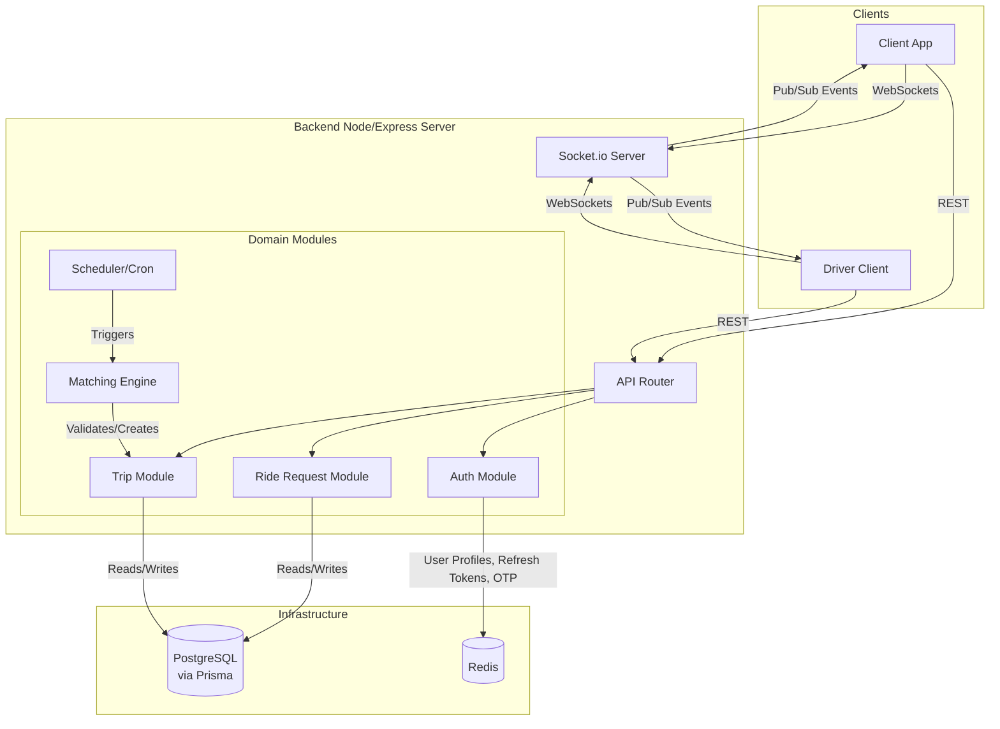

# CarpoolTU / Carpooling System

A real-time ride-matching platform that groups riders dynamically and dispatches drivers with optimized routing.

## The Problem
Urban campus and daily commuting suffer from inefficient single-occupancy rides and expensive alternative transport. This system groups riders heading in similar directions by computing permissible detours in real-time. It provides a seamless connection between riders and drivers while minimizing added travel distance and maximizing vehicle capacity.

## Architecture



## Key Engineering Decisions

1. **Transactional Row-Level Locking for Matching:** 
   To prevent race conditions across multiple node instances, the matching cron job (`matchingIntegration.js`) fetches pending ride requests using PostgreSQL's `FOR UPDATE SKIP LOCKED`. This ensures that a single ride request isn't concurrently matched into multiple trips by overlapping cron schedules.

2. **Detour-Based Route Optimization (No Geospatial DB queries):**
   Instead of relying on PostGIS or Redis geospatial queries, the system matches riders based on raw coordinates and distance calculations (Haversine) in application memory. The matching engine (`matchingEngine.js`) validates permutations of riders to ensure no passenger's detour ratio exceeds a hard limit (`MAX_USER_DETOUR = 0.30`).

3. **Redis for Session & Cache, Socket.io for Real-Time:**
   Redis is deliberately constrained to Auth state (Refresh Token rotation with a cap of 5 per user, OTP storage) and short-lived user profile caching. Real-time driver location tracking and trip cancellation events are handled entirely through Socket.io rooms (`trip_${tripId}`) rather than Redis Pub/Sub.

4. **Graceful Auto-Expiration State Machine:**
   To prevent phantom rides, the system implements a strict state machine with time-based sweeps. `PENDING` rides whose departure times pass are auto-cancelled. Furthermore, trips stuck in `RIDERS_MATCHED` (without driver acceptance) are auto-expired after a 10-minute grace period, and all users are notified via WebSocket.

## Load Testing
*Performance numbers pending full infrastructure deployment.*

| Endpoint | Target Users | 95th Percentile Latency | Success Rate |
|----------|--------------|-------------------------|--------------|
| `POST /api/ride-requests` | 50 concurrent | *Pending* | *Pending* |
| Matching Cron Cycle | N/A | *Pending* | *Pending* |

To run the local load test:
```bash
k6 run server/load-tests/matching-scenario.js
```

## Tech Stack

| Layer | Technology | Usage |
|-------|------------|-------|
| **Core** | Node.js, Express.js | Backend server and REST API |
| **Database** | PostgreSQL, Prisma (`@prisma/client`) | Relational data mapping and schema generation |
| **Cache/State** | Redis (`ioredis`) | Refresh token management, OTPs, profile cache |
| **Real-time** | Socket.io | Driver location broadcasting, trip updates |
| **Background** | `node-cron` | Asynchronous matching batch jobs |

## Testing

The project uses custom vanilla JavaScript test scripts leveraging Node's built-in assertions.

- **Total Test Files:** 18
- **Coverage Areas:** Auto-cancellation logic, route optimization, refresh token rotation, matching idempotency, and trip constraints.

*Note: `npm run test` currently fails out of the box due to a missing runner script (`scripts/run-tests.js`). Test files in `server/tests/` can be run individually (e.g., `node tests/phase3-auth-redis.test.js`)*

## Setup Instructions

1. **Environment Configuration:**
   Copy the `.env` file (or use `.env.example` if it existed) in the `server` directory and configure the following variables:
   - `DATABASE_URL` (PostgreSQL connection string)
   - `REDIS_URL` (e.g., `redis://localhost:6379`)
   - `JWT_SECRET`, `JWT_REFRESH_SECRET`
   - `SMTP_*` variables for email sending

2. **Database Setup:**
   Run Prisma migrations to structure your Postgres database:
   ```bash
   cd server
   npx prisma db push # or npx prisma migrate dev
   ```

3. **Start the Infrastructure & Server:**
   Ensure PostgreSQL and Redis are running locally (no `docker-compose.yml` is provided). Then:
   ```bash
   cd server
   npm install
   npm run dev
   ```

## Known Limitations / What I'd Improve Next

- **Missing Test Runner:** The central test runner script (`scripts/run-tests.js`) is missing, making CI integration difficult until the test scripts are migrated to a framework like Jest or the runner is restored.
- **Matching Engine Observability:** Currently, pairs rejected due to direction or detour constraints log hardcoded `0` in the database metrics (`pairsRejectedDirection`, `pairsRejectedDetour` in `logMatchingCycle`). These should be properly counted in `matchingEngine.js` for better analytical insights.
- **Containerization:** The repository currently lacks a Dockerfile or `docker-compose.yml`, requiring manual installation of PostgreSQL and Redis for local development.

---
*(Placeholder: Embed UI Screenshots Here)*
